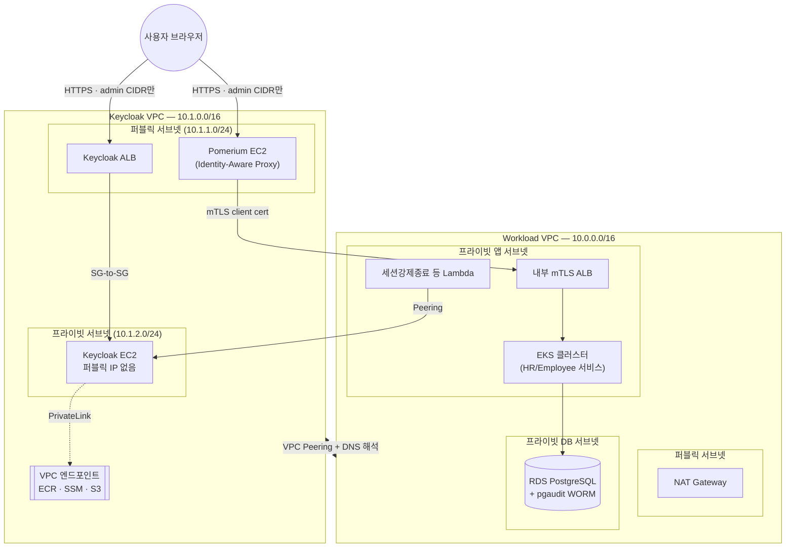

# Zero Trust HR Platform on AWS — 보안 엔지니어링 포트폴리오

AWS 위에 HR 서비스(직원/급여 정보)를 얹고, 그 위에 **Zero Trust 접근 모델 + CSPM + CIEM 자동화 파이프라인**을 직접 설계·구현한 개인 프로젝트입니다. Terraform으로 관리되는 인프라 코드 전체와, 그 인프라를 실제로 계정에 배포해 CSPM/CIEM 파이프라인을 라이브로 검증한 과정에서 나온 설계 결정·트레이드오프를 담았습니다.

> 이 저장소는 **코드 리뷰 및 포트폴리오 열람용**입니다. 실제 배포에 쓰였던 AWS 계정은 실습 종료 후 `terraform destroy`로 정리했고, 이후 프라이빗 서브넷 전환 등 일부 변경은 코드만 반영되고 재배포(라이브 검증)는 하지 않았습니다 — 각 섹션에 검증 여부를 표시했습니다.

---

## 목차

1. [한눈에 보기](#한눈에-보기)
2. [전체 아키텍처](#전체-아키텍처)
3. [CSPM — Cloud Security Posture Management](#cspm--cloud-security-posture-management)
4. [CIEM — Cloud Infrastructure Entitlement Management](#ciem--cloud-infrastructure-entitlement-management)
5. [IRSA / EKS 워크로드 아이덴티티](#irsa--eks-워크로드-아이덴티티)
6. [Zero Trust 접근 모델](#zero-trust-접근-모델)
7. [사용한 AWS 보안 서비스 매트릭스](#사용한-aws-보안-서비스-매트릭스)
8. [위협 대응 자동화](#위협-대응-자동화)
9. [저장소 구조](#저장소-구조)
10. [설계 결정 기록 (ADR)](#설계-결정-기록-adr)
11. [알려진 한계 / 트레이드오프](#알려진-한계--트레이드오프)

---

## 한눈에 보기

| | |
|---|---|
| **인프라** | Terraform (AWS Provider), 47개 파일 · 리소스 약 420개, 단일 root module |
| **워크로드** | EKS(HR 백엔드 2종 + 프론트엔드), RDS PostgreSQL |
| **IdP / SSO** | 자체 호스팅 Keycloak → SAML 8-Role 임시자격증명 |
| **경계 제어** | Pomerium(Identity-Aware Proxy) + 내부 mTLS ALB |
| **CSPM** | Security Hub(FSBP+CIS) + Config(7 커스텀 룰) + GuardDuty + Slack 실시간 알림·억제 파이프라인 |
| **CIEM** | IAM Access Analyzer(Unused Access, Policy Generation) + Permission Boundary + Slack 승인 기반 권한 축소 |
| **런타임 대응** | Security Hub Custom Action → Lambda(세션 강제종료 / EKS 파드 격리 / ASR 자동조치), 전부 사람 승인 게이트 |
| **리전 / 계정 성격** | ap-northeast-2, 개인 학습 계정(AWS Organizations 미사용) |

---

## 전체 아키텍처

두 개의 VPC를 Peering으로 연결해 "온프레미스 격(Keycloak/Pomerium VPC)"과 "AWS 워크로드 VPC(HR 서비스)"의 경계를 실습 환경에서도 의미 있게 나눴습니다.



### 계층별 방어선

| 계층 | 메커니즘 | 목적 |
|---|---|---|
| 사람 인증 | Keycloak(SAML IdP) + Pomerium | 정적 키 없이 SSO, 세션 단위 재검증 지점 확보 |
| 네트워크 진입 | 퍼블릭 리소스는 ALB만, EC2/EKS 노드는 전부 프라이빗 서브넷 | "실수로 SG를 잘못 열어도" 네트워크 계층에서 도달 불가능 |
| 서비스 간 통신 | 내부 mTLS ALB(클라이언트 인증서 필수) + SG-to-SG 참조(CIDR 지양) | 같은 VPC 안에서도 상호 인증 요구 |
| IAM 경계 | Permission Boundary(모든 SAML Role에 강제) | 개별 Role 정책이 아무리 잘못 커져도 상한선 존재 |
| 데이터 | RDS 컬럼 마스킹 뷰 + pgaudit + S3 Object Lock(WORM) 감사로그 | 조회 최소화 + 사후 변조 불가능한 증적 |
| 지속 검증 | CSPM/CIEM 자동 스캔 + Slack 알림 | "배포 시점에만 안전"이 아니라 계속 재평가 |

### Keycloak 격리 구조 개편 (Before → After)

GitHub 공개를 계기로 재검토한 부분입니다. 원래 Keycloak EC2는 퍼블릭 서브넷에서 보안그룹(관리자 IP 1개)만으로 방어했는데, 실습 중 실제로 한 번 `0.0.0.0/0`으로 임시 개방했다가 다시 좁힌 이력이 있었습니다 — SG 설정 실수 하나에 전체 SSO가 걸리는 구조는 고가치 타겟(IdP)에 맞지 않는다고 판단해 네트워크 계층 자체를 바꿨습니다. **코드까지 반영했고 `terraform validate`로 참조 무결성은 확인했지만, 계정을 이미 정리한 뒤라 라이브 재배포 검증은 하지 못했습니다** — 이 부분은 정직하게 밝혀둡니다.

| | Before | After |
|---|---|---|
| 서브넷 | 퍼블릭 (EC2가 라우팅 가능한 퍼블릭 IP 보유) | 프라이빗 (인터넷 라우팅 경로 자체가 없음) |
| 진입점 방어 | 보안그룹 admin CIDR 규칙 1개 | ALB(admin CIDR) + SG-to-SG 참조 이중화 |
| 컨테이너 이미지 | `quay.io`에서 검증 없이 직접 pull | 사람이 1회 스캔 후 올린 내부 ECR 미러(`scan_on_push`, `IMMUTABLE`)만 사용 |
| 아웃바운드 | 필요 시 NAT 경유 인터넷 | VPC 엔드포인트(PrivateLink)만, 인터넷 왕복 없음 |
| EKS API 접근(CI/CD) | 퍼블릭 엔드포인트 + IP 허용목록 | Peering DNS 해석을 켜서 EKS Private Endpoint로 직접 접근 |

관련 코드: [`infra/15-keycloak-vpc-peering.tf`](infra/15-keycloak-vpc-peering.tf), [`infra/14-keycloak-vpc-endpoints.tf`](infra/14-keycloak-vpc-endpoints.tf), [`infra/11-keycloak.tf`](infra/11-keycloak.tf), 미러링 스크립트 [`infra/scripts/mirror-keycloak-image-to-ecr.sh`](infra/scripts/mirror-keycloak-image-to-ecr.sh)

---

## CSPM — Cloud Security Posture Management

### 1) 탐지 계층

| 서비스 | 켠 기능 | 의도적으로 끈 기능 / 이유 |
|---|---|---|
| **GuardDuty** | Foundational(CloudTrail 이상탐지·DNS·VPC Flow Logs, 항상 포함) + S3 Protection + EKS Audit Log Monitoring + EBS Malware Protection | Runtime Monitoring(EKS/EC2 컨테이너 런타임 에이전트)은 끔 — Falco가 그 영역을 전담하기로 결정해 이중 탐지·이중 비용을 피함 ([ADR-003](docs/adr/ADR-003-guardduty-foundational-only.md)) |
| **Security Hub** | AWS FSBP(항상) + CIS AWS Foundations Benchmark v1.4.0(`enable_cis_benchmark`로 옵트인) | Organizations 없이 단일 계정만 쓰므로 조직 표준 배포는 대상 외 |
| **AWS Config** | 커스텀 룰 7개: SSH/RDP 인바운드 차단, IAM 미사용 자격증명(90일), Access Key 로테이션(90일), IMDSv2 강제 확인, S3 퍼블릭 읽기/쓰기 차단 | FSBP/CIS 구독 시 AWS가 자동으로 붙이는 수백 개 관리형 Config 룰과는 별도로, "이 프로젝트가 명시적으로 확인하고 싶은 항목"만 코드로 선언 |

관련 코드: [`infra/18-guardduty.tf`](infra/18-guardduty.tf), [`infra/10-security-baseline.tf`](infra/10-security-baseline.tf), [`infra/21-config-managed-rules.tf`](infra/21-config-managed-rules.tf)

### 2) 실시간 알림 파이프라인

```
Security Hub finding (CRITICAL/HIGH)
   → EventBridge
   → Lambda(cspm-alert-enrichment)  — 리소스 태그/소유자/딥링크로 컨텍스트 보강
   → Slack (chat.postMessage, [위험 수용/예외 등록] 버튼 포함)
   → 버튼 클릭 시 모달 → 사유 입력 → chat.update로 원본 메시지 갱신 + 감사 로그(CloudWatch Logs, 90일 보관)
```

Incoming Webhook으로 시작했다가, 인터랙티브 버튼(예외 등록 후 원본 메시지 수정)을 붙이면서 Slack Bot Token 방식(`chat.postMessage`)으로 통일했습니다 — Webhook과 Bot Token은 서로 다른 `bot_id`로 등록되어 있어 `chat.update`가 영구히 실패하는 문제를 라이브로 겪고 고쳤습니다.

관련 코드: [`infra/45-cspm-alert-pipeline.tf`](infra/45-cspm-alert-pipeline.tf), [`infra/47-cspm-suppress-modal.tf`](infra/47-cspm-suppress-modal.tf), [`infra/scripts/cspm-alert-enrichment.py`](infra/scripts/cspm-alert-enrichment.py) · 상세 흐름: [`docs/CSPM-ALERT-PIPELINE.md`](docs/CSPM-ALERT-PIPELINE.md)

### 3) Suppress(억제) 체계 — "무엇을, 왜 억제했는가"

CSPM 알림이 실제로 조치가 필요한 항목에만 집중되도록, 3단 억제 체계를 구성했습니다.

| 방식 | 대상 | 감사 추적 |
|---|---|---|
| **Security Hub Automation Rule #1**<br/>`suppress_dev_tagged` | `Environment=suppresstag` 태그가 **명시적으로 옵트인**된 리소스만 | 평가 즉시 SUPPRESSED + 자동 Note 기록 |
| **Security Hub Automation Rule #2**<br/>`suppress_known_accepted_risks` | 이미 위험 수용 결정이 끝난 반복 재발성 finding(예: "SSM Interface Endpoint 미구성" — 비용 트레이드오프로 의도적 미구성) | 재발해도 평가 즉시 SUPPRESSED, 근거는 `security-hub-suppress-accepted-risks.sh`의 결정과 동일 |
| **Slack 수동 예외 등록** | 사람이 Slack 모달에서 사유를 입력해 개별 finding을 억제 | Lambda가 CloudWatch Logs(`/aws/cspm/exception-records`)에 승인자·사유·시각을 구조화 로그로 남김 (90일 보관) |

> 최초 설계는 `Environment=dev` 태그로 매칭했는데, 이 태그가 provider `default_tags`로 거의 모든 리소스에 자동으로 붙어서 EC2 퍼블릭 IP처럼 실제로 봐야 하는 HIGH 심각도 finding까지 같이 묻히는 문제를 라이브로 확인했습니다. `suppresstag`라는 별도 값으로 분리해 "이 계정이 dev인지"와 "이 리소스는 억제해도 되는지"를 명확히 구분했습니다 — 실제 운영에서 태그 하나로 여러 의미를 겸용하면 생기는 사이드 이펙트를 직접 겪고 고친 사례입니다.

실습 중 관찰된 실제 수치(계정 종료 시점 스냅샷, 재현용 정확한 값이 아니라 체계가 어떻게 작동하는지 보여주는 예시): 억제 119건(수동 4건 · 태그 옵트인 38건 · 알려진 위험수용 22건 · Terraform 관리 위험수용 55건), 미해결 active 45건(Critical 1 · High 2 · Medium 25 · Low 17). 전체 상세는 실습 종료 직전 스냅샷 문서(`docs/BACKUP-BEFORE-DESTROY-2026-08-17.md`, 계정 특정 정보가 많아 이 공개 저장소에는 미포함)에 남겨뒀습니다.

관련 코드: [`infra/46-cspm-automation-rules.tf`](infra/46-cspm-automation-rules.tf), [`infra/scripts/security-hub-suppress-accepted-risks.sh`](infra/scripts/security-hub-suppress-accepted-risks.sh), [`infra/scripts/ciem-key-exception-callback.py`](infra/scripts/ciem-key-exception-callback.py)

### 4) 시각화

Grafana(Amazon Managed Grafana)에 CSPM 전용 대시보드 3종을 프로비저닝: 인터랙티브 finding 탐색기, 리소스 탐색기, SOC 개요판. CloudWatch Logs Insights와 Athena 두 엔진을 같이 쓰다 보니 **한글 별칭 이스케이프 문법이 엔진마다 다르다**(CWLI는 백틱, Athena/Presto는 큰따옴표)는 점, `dedup` 뒤에 `filter`를 못 쓴다는 점, `stats` 별칭을 원본 필드명과 같게 주면 그 필드가 조용히 사라진다는 점을 전부 라이브 쿼리로 검증하며 고쳤습니다.

관련 코드: [`infra/docs/grafana/`](infra/docs/grafana/), [`infra/25-grafana.tf`](infra/25-grafana.tf)

---

## CIEM — Cloud Infrastructure Entitlement Management

### 1) Permission Boundary — 모든 권한의 상한선

8개 SAML Role 전부에 강제로 적용되는 Permission Boundary입니다. "필요한 권한을 화이트리스트로 나열"하는 대신 **"절대 못 넘는 상한선"을 정의**하는 방식을 택했습니다 — 개별 Role 정책이 나중에 넓어져도, 이 경계 밖으로는 절대 못 나갑니다.

```jsonc
{
  "AllowBroadServiceAccessAsUpperBound": "IAM/Organizations/Billing/SSO 등을 제외한 모든 서비스 (상한선일 뿐, 실제 권한은 각 Role의 인라인 정책이 별도로 좁힘)",
  "AllowAssumeRoleWithSAMLOnly": "SAML로만 AssumeRole 허용 (정적 키 기반 AssumeRole 원천 차단)",
  "ExplicitDenyStaticCredentialCreation": "IAM 사용자/Access Key/로그인 프로필 생성 전면 금지",
  "DenyBoundaryPolicyTampering": "이 Boundary 정책 자체를 떼거나 바꾸는 행위 금지 (자기 권한 상승 방지)"
}
```

가장 중요한 설계 포인트는 마지막 `DenyBoundaryPolicyTampering`입니다 — Boundary가 아무리 잘 만들어도 누군가 그 Boundary를 스스로 떼어낼 수 있으면 무의미하므로, Boundary 자체의 탈부착을 Boundary 안에서 금지합니다.

관련 코드: [`infra/policies/01-permission-boundary.json`](infra/policies/01-permission-boundary.json), [`infra/12-iam-saml-roles.tf`](infra/12-iam-saml-roles.tf)

### 2) 미사용 권한 탐지 — 두 가지 주기로 이중화

| 체계 | 도구 | 주기 | 대응 |
|---|---|---|---|
| **월간 Unused Access 리포트** | IAM Access Analyzer(`ACCOUNT_UNUSED_ACCESS`, 90일 기준) | 매월 1회 | Slack 요약 보고 |
| **권한 드리프트 체크(확장판)** | IAM Access Analyzer **Policy Generation**(실제 CloudTrail API 사용 이력 분석) | 훨씬 짧은 주기(데모 기본 3시간 — 운영 전환 시 90일급으로 늘려야 함, 코드 주석에 명시) | Slack에 "이 권한 실제로 안 씀" 알림 + **승인 버튼을 눌러야만** 축소 적용 |

두 체계 모두 "발견은 자동, 실행(삭제/축소)은 사람 승인 후"라는 동일한 원칙을 따릅니다 — 자동으로 권한을 빼는 파이프라인은 의도적으로 만들지 않았습니다. CI/CD Role의 Access Key 미사용 예외 처리도 같은 Slack 인터랙티브 라우터를 공유합니다.

관련 코드: [`infra/24-ciem-lambda.tf`](infra/24-ciem-lambda.tf), [`infra/36-ciem-boundary-drift-check.tf`](infra/36-ciem-boundary-drift-check.tf), [`infra/slack-interactive-router.tf`](infra/slack-interactive-router.tf), [`infra/scripts/ciem-unused-access-report.py`](infra/scripts/ciem-unused-access-report.py)

### 3) 실시간 위반 감시 — Permission Boundary 우회 시도 탐지

8개 SAML Role은 설계상 인라인 정책 하나만 쓰고 관리형 정책(`AttachRolePolicy`)이 붙는 경우가 원래 없어야 합니다. CloudTrail의 `AttachRolePolicy` 관리 이벤트를 EventBridge(계정 기본 이벤트 버스, 별도 Trail 불필요)로 실시간 수신해, 위반이 감지되면 Grafana 테이블 패널로 남기고 Slack에 **원클릭 세션 잠금 버튼**과 함께 알립니다.

> IAM은 글로벌 서비스라 이 이벤트는 리전과 무관하게 항상 `us-east-1`에서만 EventBridge 기본 버스에 도착합니다 — `ap-northeast-2`에 규칙을 만들었을 때 지표가 전혀 안 잡히는 걸 라이브로 확인하고서야 알게 된 사실이라, 이 파일만 `provider = aws.us_east_1`로 명시적으로 배포합니다.

관련 코드: [`infra/44-iam-boundary-violation-watch.tf`](infra/44-iam-boundary-violation-watch.tf), [`infra/scripts/iam-boundary-violation-watch.py`](infra/scripts/iam-boundary-violation-watch.py)

---

## IRSA / EKS 워크로드 아이덴티티

EKS 파드가 AWS API를 호출할 때 정적 자격증명을 쓰지 않도록, 두 가지 메커니즘을 목적에 맞게 나눠 썼습니다.

| 메커니즘 | 대상 | 이유 |
|---|---|---|
| **IRSA** (`aws_iam_openid_connect_provider` + IAM Role trust policy를 ServiceAccount에 매핑) | AWS Load Balancer Controller | 클러스터 애드온 계열은 여전히 IRSA가 표준 패턴이라 그대로 사용 |
| **EKS Pod Identity** (`aws_eks_addon.pod_identity` + `aws_eks_pod_identity_association`) | 이후 배포하는 애플리케이션 워크로드 | OIDC federation 설정 없이 Pod Identity Agent가 자격증명을 주입 — Role 하나를 여러 앱이 공유하지 않고 앱마다 전용 최소권한 Role을 붙이는 원칙([ADR-011](docs/adr/ADR-011-dedicated-least-privilege-roles.md))과 결합 |

**Pod Security 강제 방식도 실습 중 한 번 갈아엎었습니다**: 원래 Kyverno(Helm으로 컨트롤러+웹훅 배포)로 Pod Security를 강제하려 했으나, 실제로 쓴 기능이 baseline Audit 강제 하나뿐이었는데도 컨트롤러 파드 전체를 떠안았고, `terraform destroy` 시 Kyverno의 삭제 훅 파드가 이미지를 받아오지 못해 destroy가 반복적으로 멈추는 문제를 실제로 겪었습니다. K8s 1.25+ 내장 기능인 **Pod Security Admission**(네임스페이스 라벨만으로 동작, 별도 컨트롤러/웹훅 불필요)으로 대체했습니다 — "필요한 기능 대비 컴포넌트가 과하다"는 걸 배포 이후 단계(destroy)에서 발견하고 걷어낸 사례입니다.

관련 코드: [`infra/05-iam-alb-controller.tf`](infra/05-iam-alb-controller.tf), [`infra/20-eks-pod-identity.tf`](infra/20-eks-pod-identity.tf), [`infra/34-k8s-namespaces-rbac.tf`](infra/34-k8s-namespaces-rbac.tf) · 결정 기록: [ADR-009](docs/adr/ADR-009-eks-pod-identity-and-pss.md), [ADR-020](docs/adr/ADR-020-psa-replaces-kyverno.md)

---

## Zero Trust 접근 모델

NIST SP 800-207 원칙을 실습 규모에 맞게 구현했습니다.

- **사람 접근은 SAML 임시자격증명만** — Keycloak(SSO) → SAML → 8개 Role 중 하나로 AssumeRole. 정적 IAM Access Key를 사람에게 발급하지 않습니다. ([ADR-001](docs/adr/ADR-001-saml-temporary-credentials-for-humans.md), [ADR-019](docs/adr/ADR-019-eight-role-structure.md))
- **EC2 접속은 SSM Session Manager만, SSH 전면 금지** — 보안그룹에 22번 포트 인바운드 규칙 자체가 없습니다. ([ADR-002](docs/adr/ADR-002-ssm-only-no-ssh.md))
- **CI/CD도 정적 키 없음** — GitHub Actions는 OIDC로 단기 Role을 발급받아 배포합니다(장기 Access Key 미발급). ([ADR-006](docs/adr/ADR-006-github-actions-oidc.md))
- **서비스 간에도 상호 인증** — Pomerium(Identity-Aware Proxy)이 최종 사용자 요청을 SSO로 재검증한 뒤, 내부 mTLS ALB로 클라이언트 인증서까지 요구하는 HR 백엔드까지 전달합니다. 같은 VPC 안이라고 신뢰하지 않습니다.
- **진행 중 세션의 지속적 재평가** — 발급 시점 한 번 검증하고 만료까지 유효한 모델의 공백을 메우기 위해, Security Hub Custom Action으로 특정 인물의 세션(8개 Role 전부 + Keycloak 세션)을 실시간에 가깝게 강제 종료할 수 있습니다.
- **보안그룹 위생** — CIDR 대신 SG-to-SG 참조를 우선하고, 모든 SG에 SSH 인바운드가 없는지 Config로 상시 확인합니다. ([ADR-012](docs/adr/ADR-012-security-group-hygiene.md))

관련 코드: [`infra/12-iam-saml-roles.tf`](infra/12-iam-saml-roles.tf), [`infra/32-mtls-alb.tf`](infra/32-mtls-alb.tf), [`infra/33-pomerium.tf`](infra/33-pomerium.tf), [`infra/35-session-revocation.tf`](infra/35-session-revocation.tf), [`infra/22-cicd-oidc.tf`](infra/22-cicd-oidc.tf)

---

## 사용한 AWS 보안 서비스 매트릭스

| 서비스 | 이 프로젝트에서의 역할 |
|---|---|
| **GuardDuty** | 위협 탐지(Foundational + S3 + EKS Audit + Malware Protection) |
| **Security Hub** | CSPM 중앙화(FSBP+CIS), Automation Rules, Custom Action 오케스트레이션 |
| **AWS Config** | 상시 설정 준수 확인(커스텀 7룰 + 표준 구독 시 자동 관리형 룰) |
| **IAM Access Analyzer** | CIEM 핵심 — Unused Access 분석 + Policy Generation |
| **CloudTrail** | 전체 API 감사 로그, EventBridge 실시간 트리거의 소스 |
| **Security Lake** | 네이티브 지원 로그 소스 통합 수집(OCSF 정규화) |
| **Automated Security Response on AWS (ASR)** | Config/Security Hub finding 자동 교정 런북(Custom Action 트리거, 사람 승인) |
| **VPC Flow Logs** | 네트워크 트래픽 감사 |
| **S3 Object Lock (COMPLIANCE)** | RDS 감사로그 WORM 보존 — 계정 소유자 포함 누구도 보존기간 내 삭제 불가 |
| **KMS** | 저장 데이터 암호화(RDS, S3, CloudWatch Logs 등) |
| **Systems Manager (Session Manager / Parameter Store)** | SSH 대체 접속 경로 + 런타임 설정값 배포 |
| **ACM (Private CA 패턴)** | 내부 mTLS ALB용 자체 서명 인증서 체인 |
| **CloudWatch (Logs Insights / Alarms)** | CIS 기준 알람, CSPM/CIEM 대시보드 쿼리 엔진 |
| **EKS Pod Identity / IRSA** | 파드 단위 최소권한 AWS 자격증명 |
| **VPC Endpoints (Interface/Gateway, PrivateLink)** | 프라이빗 서브넷에서 인터넷 경유 없이 ECR/SSM/S3 접근 |
| **ECR (이미지 스캐닝, IMMUTABLE 태그)** | 서드파티 레지스트리 직접 pull 대신 검증된 내부 미러 |
| **Amazon Managed Grafana** | CSPM/CIEM/인프라 관측 대시보드 (SAML SSO 로그인) |

---

## 위협 대응 자동화

전부 **"발견은 자동, 실행은 사람 승인 후"** 원칙을 따릅니다 ([ADR-005](docs/adr/ADR-005-human-approval-for-destructive-actions.md)) — 파괴적이거나 서비스 영향이 있는 조치는 Security Hub Custom Action을 사람이 직접 눌러야 실행됩니다.

| 조치 | 트리거 | 실행 내용 |
|---|---|---|
| 세션 강제 종료 | Custom Action `RevokeUserSession` | 대상 인물의 8개 Role 세션 + Keycloak 세션 동시 무효화 |
| EKS 파드 격리 | Custom Action `IsolateEksPod` | quarantine 라벨 부착 + deny-all NetworkPolicy 적용 |
| 설정 오류 자동조치 | Custom Action `ASRRemediation` | AWS Solutions ASR의 SSM Automation 런북 실행(Config/Security Hub control 기준) |
| IAM 권한 축소 | Slack 승인 버튼 | Policy Generation이 제안한 축소 정책 적용 |
| Access Key 삭제 | Slack 승인 버튼 | 미사용 확인된 Access Key 삭제 |

관련 코드: [`infra/35-session-revocation.tf`](infra/35-session-revocation.tf), [`infra/29-eks-pod-isolation.tf`](infra/29-eks-pod-isolation.tf), [`infra/27-asr-remediation.tf`](infra/27-asr-remediation.tf), [`infra/41-asr-member-remediation.tf`](infra/41-asr-member-remediation.tf)

---

## 저장소 구조

```
final-code/
├── README.md                 이 문서
├── infra/                    Terraform root module (단일 디렉터리, 번호순 = 읽는 순서)
│   ├── 00-versions.tf ~ 47-cspm-suppress-modal.tf
│   ├── policies/              IAM 정책 JSON/템플릿 (Permission Boundary, SAML Role 8종)
│   ├── scripts/                Lambda 소스 + 운영/데모 스크립트 (scenarios/ 포함)
│   ├── platform-grafana/      인프라 관측용 Grafana 대시보드 JSON
│   ├── docs/grafana/           CSPM/CIEM 대시보드 JSON 3종 (path.module 참조라 infra/ 밑에 위치)
│   ├── *.sh.tpl                 EC2 user_data 템플릿 (Keycloak, Pomerium)
│   └── terraform.tfvars.example  실제 값 없는 변수 예시 (terraform.tfvars는 gitignore)
├── apps/
│   ├── hr-app/                HR 백엔드 2종(FastAPI) + 프론트엔드(React) + K8s 매니페스트
│   └── frontend-test/         Keyless CI/CD(GitHub OIDC) 증적용 별도 앱
└── docs/
    ├── adr/                    설계 결정 기록 20건
    ├── CSPM-ALERT-PIPELINE.md   알림 파이프라인 상세 흐름
    ├── TROUBLESHOOTING.md      라이브 실습 중 실제로 겪은 오류와 해결 과정
    └── BACKLOG.md               의도적으로 미룬 작업과 그 이유
```

---

## 설계 결정 기록 (ADR)

이 프로젝트의 모든 비자명한 설계 판단은 ADR로 남겼습니다. "왜 이렇게 안 했는가"까지 포함해서 기록하는 걸 원칙으로 삼았습니다.

| ADR | 결정 |
|---|---|
| [001](docs/adr/ADR-001-saml-temporary-credentials-for-humans.md) | 사람의 AWS 접근은 SAML 임시자격증명만 사용 |
| [002](docs/adr/ADR-002-ssm-only-no-ssh.md) | EC2 접속은 SSM Session Manager만, SSH 전면 금지 |
| [003](docs/adr/ADR-003-guardduty-foundational-only.md) | GuardDuty는 Foundational만, Runtime Monitoring은 Falco 담당 |
| [004](docs/adr/ADR-004-aws-fsbp-account-baseline.md) | 계정 보안 베이스라인은 AWS FSBP 정렬 |
| [005](docs/adr/ADR-005-human-approval-for-destructive-actions.md) | 보안 알림 파이프라인 + 파괴적 자동조치는 사람 승인 필수 |
| [006](docs/adr/ADR-006-github-actions-oidc.md) | GitHub Actions는 OIDC로 단기 Role, 정적 키 없음 |
| [007](docs/adr/ADR-007-ciem-unused-access-cycle.md) | CIEM — 미사용 권한을 주기적으로 찾아 최소화 |
| [008](docs/adr/ADR-008-log-retention-worm-separation.md) | 로그는 실시간(짧게)과 장기 증적(WORM)을 분리 보관 |
| [009](docs/adr/ADR-009-eks-pod-identity-and-pss.md) | EKS Pod Identity 활성화 + Pod Security 강제 |
| [010](docs/adr/ADR-010-observability-grafana-login.md) | Grafana 로그인 연동 방식 |
| [011](docs/adr/ADR-011-dedicated-least-privilege-roles.md) | 서비스/인스턴스마다 전용 최소권한 Role 발급 |
| [012](docs/adr/ADR-012-security-group-hygiene.md) | 보안그룹 위생 — SSH 금지, SG-to-SG 참조 우선 |
| [013](docs/adr/ADR-013-runtime-threat-response-framework.md) | 런타임 위협 탐지 대응은 사람 승인 기반 자동조치로 |
| [014](docs/adr/ADR-014-asr-misconfiguration-remediation.md) | 설정 오류 자동조치는 AWS ASR을 CloudFormation으로 배포 |
| [015](docs/adr/ADR-015-security-lake-native-sources.md) | Security Lake에 네이티브 지원 로그 소스를 전부 등록 |
| [016](docs/adr/ADR-016-python-automation-script-standard.md) | Lambda 자동화 스크립트는 공통 구조를 따름 |
| [017](docs/adr/ADR-017-unused-access-human-approval-flow.md) | 미사용 Access Key도 발견은 자동, 삭제는 사람 승인 |
| [018](docs/adr/ADR-018-five-role-structure-superseded.md) | (초기안, 폐기) SAML Role 5종 구조 |
| [019](docs/adr/ADR-019-eight-role-structure.md) | SAML Role 8종 + ABAC 폐기 |
| [020](docs/adr/ADR-020-psa-replaces-kyverno.md) | Kyverno 대신 K8s 내장 PSA로 Pod Security 강제 |

---

## 알려진 한계 / 트레이드오프

개인 학습 계정이라는 제약 안에서 내린 의도적인 타협들입니다 — 실무 전환 시 바뀌어야 할 지점을 스스로 표시해뒀습니다.

- **AWS Organizations 미사용**: 프리티어/비용 문제로 도입하지 않아, 계정 전체에 SCP를 강제할 방법이 없습니다. IMDSv2 강제 같은 항목은 "탐지"까지만 하고 강제는 사람/ASR이 처리합니다.
- **CIEM 드리프트 체크 관찰 기간(3시간)은 데모 값**: 실제 운영에서는 90일급으로 늘려야 저빈도 정당 업무 권한이 오탐되지 않습니다.
- **RDS 감사로그 WORM 보존기간은 실습 중 1일로 낮춰서 사용**: 실서비스 기준(ISMS-P 요구사항)은 365일이며, 짧게 설정한 보존기간이 지나기 전 데이터는 실제로 계정 정리 이후에도 삭제가 불가능하다는 것을 직접 겪었습니다.
- **NAT Gateway 대신 VPC 엔드포인트로 비용 최적화**: 다만 서드파티 레지스트리(quay.io)처럼 AWS 서비스가 아닌 대상은 VPC 엔드포인트로 커버되지 않아, 사전 이미지 미러링이라는 별도 운영 절차가 필요합니다.
- **단일 AZ 구성 다수**: 고가용성보다 비용/복잡도를 우선한 데모 환경이라, NAT Gateway·일부 서브넷이 단일 AZ입니다.
- **Keycloak 프라이빗 서브넷 전환은 코드만 반영, 라이브 미검증**: 위 아키텍처 섹션에 명시.

