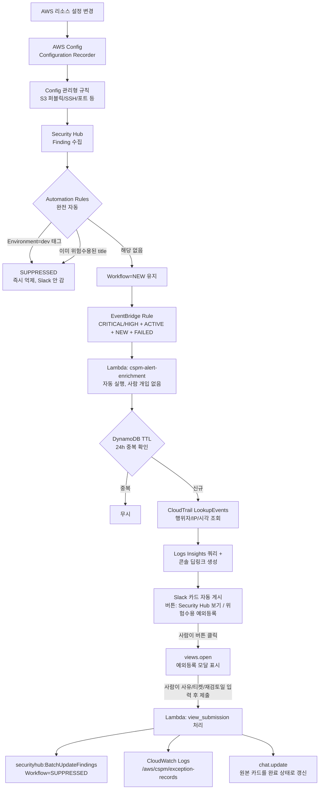

# CSPM 실시간 알림 & 대응 자동화 파이프라인

`45-cspm-alert-pipeline.tf` + `46-cspm-automation-rules.tf` + `scripts/cspm-alert-enrichment.py`가
구현체다. 기존 `23-security-alerting.tf`(GuardDuty+SecurityHub severity≥7 →
SNS → Chatbot)는 그대로 두고, 그 위에 Security Hub 전용 정밀 필터 + 컨텍스트
강화 레이어를 얹었다.

## 1. 아키텍처



핵심 설계 포인트:

- **1차 억제(Automation Rules)는 완전 자동, 사람 개입 전혀 없음** - Lambda가
  뜨기도 전에, finding이 만들어지는 순간 조건에 맞으면 `SUPPRESSED`로 바뀌어서
  EventBridge 필터에 아예 안 걸린다. Lambda 호출 자체가 안 생기니 Lambda
  과금도, Slack 노이즈도 원천에서 없어진다. Slack에 아예 도착하지 않는다.
- **2차 필터(EventBridge) → Lambda → Slack 카드 게시까지도 전부 자동** -
  Severity Label(CRITICAL/HIGH 문자열, 23번 파일의 숫자 threshold보다 정밀),
  Workflow Status=NEW(이미 처리된 건 재통지 안 함), RecordState=ACTIVE(해소된
  건 제외), Compliance Status=FAILED(정보성 finding 제외) 네 조건이 전부
  AND로 맞으면 사람이 아무것도 안 해도 Slack에 카드가 뜬다. 여기까진 "알림"만
  하는 것이지 아무것도 억제(suppress)하지 않는다.
- **중복 억제는 DynamoDB TTL로 상태를 갖는다** - 같은 finding_id가 24시간
  안에 또 오면(예: 주기적 재평가로 같은 finding이 갱신될 때) Slack에 다시
  안 보낸다. 이 DynamoDB 테이블은 **"같은 알림을 또 보낼지 말지"만** 판단하는
  용도다 - 예외 처리 이력을 저장하는 게 아니다(그건 아래 CloudWatch Logs
  담당). DynamoDB가 없었다면 Config가 같은 리소스를 재평가할 때마다(주기적
  재평가 포함) 이미 알고 있는 finding에 대해서도 매번 새 Slack 카드가 또
  올라와서 노이즈가 쌓였을 것이다.
- **3차, Suppress(억제) 자체는 100% 수동이다** - Slack 카드가 자동으로
  왔다고 해서 아무것도 억제되지 않는다. 담당자가 카드를 보고 "이건 예외로
  처리하겠다"고 판단해서 `🛑 위험 수용 / 예외 등록` 버튼을 직접 눌러야
  모달이 뜨고, 거기서 사유(reason_type)/티켓 번호/근거(rationale)/보완
  통제(compensating)/재검토일(review_date)을 사람이 직접 입력해서 제출해야만
  그제서야 `securityhub:BatchUpdateFindings`가 호출돼 실제로 SUPPRESSED
  처리된다. 이 모달 제출이 곧 사람의 승인 그 자체다(ADR-005 결정 5와 동일한
  패턴 - CIEM 쪽 Lock/Approve 버튼들과 같은 설계 원칙). 제출된 내용은
  CloudWatch Logs `/aws/cspm/exception-records`에 구조화 JSON으로 남고,
  원본 Slack 카드도 `chat.update`로 "✅ @누가 예외 처리 완료함" 상태로 바뀐다.

## 2. Security Hub Automation Rules

### Terraform (이미 적용됨, `46-cspm-automation-rules.tf`)

`aws_securityhub_automation_rule` 리소스 2개 - dev 태그 자동 억제, 기존
위험수용 title 재발 자동 억제.

### 콘솔로 만드는 경우

Security Hub → Automations → Create rule → Criteria에서 `Resource tags`
필드에 `Environment = dev` 추가 → Actions에서 `Suppress finding` 선택.

### AWS CLI로 만드는 경우 (Terraform 없이 임시로 하나 더 추가하고 싶을 때)

```bash
aws securityhub batch-create-automation-rules --cli-input-json '{
  "Rules": [{
    "RuleName": "suppress-test-account-findings",
    "RuleOrder": 3,
    "RuleStatus": "ENABLED",
    "IsTerminal": false,
    "Criteria": {
      "ResourceTags": [{"Comparison": "EQUALS", "Key": "Owner", "Value": "test"}],
      "WorkflowStatus": [{"Comparison": "EQUALS", "Value": "NEW"}]
    },
    "Actions": [{
      "Type": "FINDING_FIELDS_UPDATE",
      "FindingFieldsUpdate": {
        "Workflow": {"Status": "SUPPRESSED"},
        "Note": {"Text": "테스트 계정 - CLI로 임시 추가", "UpdatedBy": "cli-adhoc"}
      }
    }]
  }]
}'
```

## 3. EventBridge Event Pattern

```json
{
  "source": ["aws.securityhub"],
  "detail-type": ["Security Hub Findings - Imported"],
  "detail": {
    "findings": {
      "Severity": { "Label": ["CRITICAL", "HIGH"] },
      "Workflow": { "Status": ["NEW"] },
      "RecordState": ["ACTIVE"],
      "Compliance": { "Status": ["FAILED"] }
    }
  }
}
```

## 4. Config 비용 최적화

### 4.1 관리형 규칙 - 최소 필수만

이미 `21-config-managed-rules.tf`에 SSH/공용포트/IAM 키 회전/IMDSv2 5개가
있고, 이번에 S3 퍼블릭 차단 2개(`S3_BUCKET_PUBLIC_READ_PROHIBITED`,
`S3_BUCKET_PUBLIC_WRITE_PROHIBITED`)를 추가했다(`46-cspm-automation-rules.tf`).
Conformance Pack(AWS 보안 표준 하나당 수십~수백 개 규칙을 한꺼번에 배포)은
쓰지 않는다 - 규칙 하나하나가 리소스 변경마다 재평가되고, 그 평가 건수가
과금 단위라 필요 이상으로 규칙을 늘리면 곧바로 비용이 는다. 지금 7개는
계정당 매달 제공되는 무료 규칙 평가 한도 안에서 해결된다.

### 4.2 Recording Scope 최적화 (`10-security-baseline.tf`)

`all_supported=true`(전체 리소스 타입 기록)에서 `EXCLUSION_BY_RESOURCE_TYPES`
전략으로 바꾸고, 변경이 잦아 Configuration Item(=과금 단위) 건수를 불필요하게
늘리는 타입만 제외했다:

- `AWS::AutoScaling::AutoScalingGroup` / `LaunchConfiguration` - EKS managed
  node group이 내부적으로 ASG를 씀, 스케일링될 때마다 CI 발생
- `AWS::EC2::LaunchTemplate` - 노드그룹 교체마다 새로 생김
- `AWS::ECS::TaskDefinition` / `Service` - 이 프로젝트는 ECS 미사용, 혹시
  나중에 생겨도 배포마다 새 리비전이 CI를 폭증시킴

나머지 리소스 타입(S3, IAM, EC2 인스턴스, RDS, VPC/SG 등 보안 판단에 실제로
쓰이는 것들)은 그대로 전부 기록된다 - "적게 켜서 아끼는" 게 아니라 "안 봐도
되는 것만 정확히 골라서 뺀다"는 접근이다.

### 4.3 Config Advanced Query - 신규 비용 없이 기존 데이터로 영향도 분석

Config Advanced Query는 이미 기록 중인 Configuration Item과 그 리소스 간
관계(relationships) 데이터를 SQL과 비슷한 문법으로 조회하는 기능이다 -
쿼리 자체에 별도 과금이 없다(Config 자체가 이미 켜져 있다는 전제).

**보안그룹을 수정하기 전, 지금 그 SG를 쓰고 있는 자원 전부 확인:**

```bash
aws configservice select-resource-config --expression '
SELECT
  resourceId, resourceType, resourceName, relationships
WHERE
  relationships.resourceType = '"'"'AWS::EC2::SecurityGroup'"'"'
  AND relationships.resourceId = '"'"'sg-0123456789abcdef0'"'"'
'
```

**특정 서브넷 안의 EC2 인스턴스 전부 확인(서브넷 라우팅 변경 전 영향도 파악):**

```bash
aws configservice select-resource-config --expression '
SELECT
  resourceId, resourceName, configuration.privateIpAddress
WHERE
  resourceType = '"'"'AWS::EC2::Instance'"'"'
  AND configuration.subnetId = '"'"'subnet-0123456789abcdef0'"'"'
'
```

**퍼블릭 오픈된 S3 버킷이 몇 개나 있는지 전체 스캔(Config Advanced Query만으로,
Security Hub 콘솔 없이):**

```bash
aws configservice select-resource-config --expression '
SELECT
  resourceId, resourceName, configuration.publicAccessBlockConfiguration
WHERE
  resourceType = '"'"'AWS::S3::Bucket'"'"'
  AND configuration.publicAccessBlockConfiguration.blockPublicAcls = false
'
```

## 5. 데모 시나리오 (2분 내외)

무결성 확인: 아래 전부 프로덕션 리소스가 아니라 이 프로젝트 전용 리소스만
건드린다. S3 실험은 `cloudtrail_bucket`/`config_bucket`처럼 실제 로그가
들어있는 버킷 말고, 별도 빈 테스트 버킷으로 할 것.

**ASR과 안 겹치는 이유(라이브로 확인함, 촬영 중 안심하고 진행 가능):** ASR의
`RemediationConfigTable`을 스캔해보면 S3.1/S3.2/S3.3/S3.8 등 S3 관련 컨트롤이
전부 `automatedRemediationEnabled=false`다. ASR의 트리거 규칙
(`Remediate_with_ASR_CustomAction`)도 `Security Hub Findings - Custom Action`
이벤트만 구독하므로, 사람이 Security Hub 콘솔에서 "Actions → Remediate with
this action"을 직접 누르지 않는 한 아래 버킷은 조치 없이 공개 상태 그대로
유지된다. Automation Rule(2절) 자동 억제도 dev 태그나 known-risk 제목에 안
걸리므로 발동 안 함 - 이 데모 동안 자동으로 반응하는 건 아래 45번 파일의
Slack 알림 하나뿐이다.

```bash
# 0. (사전) 테스트용 빈 버킷 하나 생성 - 데모 전용, 실제 데이터 없음
aws s3 mb s3://demo-project-dev-cspm-demo-target-$(aws sts get-caller-identity --query Account --output text)

# 1. [00:00] "실수" 재현 - 퍼블릭 ACL 오픈
aws s3api put-public-access-block \
  --bucket demo-project-dev-cspm-demo-target-<ACCOUNT_ID> \
  --public-access-block-configuration BlockPublicAcls=false,IgnorePublicAcls=false,BlockPublicPolicy=false,RestrictPublicBuckets=false

# 2. [00:05~] Config가 변경을 감지하고 재평가 → Security Hub가 FAILED finding 생성
#    (보통 수 분 내 - 재현성 위해 미리 05-15분 정도 텀을 두고 촬영 순서 배치 권장)
#    강제로 즉시 재평가를 트리거하고 싶으면:
aws configservice start-config-rules-evaluation \
  --config-rule-names demo-project-dev-s3-bucket-public-read-prohibited demo-project-dev-s3-bucket-public-write-prohibited

# 3. [00:30~] Slack에 카드 도착 확인 (화면 녹화 - Slack 채널)
#    카드 안의 "Security Hub에서 보기" 버튼과 Logs Insights 쿼리 블록 클릭/복사 시연

# 4. [01:00~] CloudWatch Logs Insights 콘솔에서 방금 복사한 쿼리 붙여넣고 실행
#    → "누가 언제 이 버킷을 건드렸는지" 원본 CloudTrail 레코드까지 직접 확인

# 5. [01:30~] Config Advanced Query로 영향도 확인(위 4.3의 S3 예시) →
#    "이 버킷 말고 다른 데도 퍼블릭 오픈된 게 있는지" 계정 전체 스캔 시연

# 6. [01:50] 원복 + 정리
aws s3api put-public-access-block \
  --bucket demo-project-dev-cspm-demo-target-<ACCOUNT_ID> \
  --public-access-block-configuration BlockPublicAcls=true,IgnorePublicAcls=true,BlockPublicPolicy=true,RestrictPublicBuckets=true
aws s3 rb s3://demo-project-dev-cspm-demo-target-<ACCOUNT_ID> --force
```

**억제 규칙 대비 시연(선택, 위 다음에 이어서 찍으면 "노이즈 제거"까지 한 번에
보여줄 수 있음):** 같은 버킷에 `Environment=dev` 태그를 붙이고 다시 퍼블릭
오픈 → 이번엔 Slack에 안 옴(Automation Rule이 평가 즉시 억제) → Security Hub
콘솔에서 그 finding의 Workflow Status가 `SUPPRESSED`로 바로 찍혀있는 걸 확인.

## 6. Slack 모달 기반 수동 예외(Suppress) 등록

Automation Rule(2절)은 "미리 정해둔 유형"만 자동 억제한다. 그 외의 finding을
사람이 개별 검토해서 예외 처리할 땐 Slack 카드의 `🛑 위험 수용 / 예외 등록`
버튼으로 모달을 띄워 티켓 번호/사유/대응 근거/재검토일을 남기고
`securityhub:BatchUpdateFindings`로 SUPPRESSED 처리한다. 구현체는
`scripts/ciem-key-exception-callback.py`(28번 파일 소유 콜백 Lambda에 통합,
새 Lambda/API Gateway 없음) + `47-cspm-suppress-modal.tf`(로그 그룹 +
추가 IAM 권한). 모든 처리 기록은 CloudWatch Logs
`/aws/cspm/exception-records`(90일 보관)에 구조화 JSON으로 남는다.

### Grafana Logs Insights 쿼리

**Table 패널 - 예외 등록 이력 전체 목록:**

```
fields timestamp, ticketRef, reasonType, resourceId, reviewDate, approvedBy, findingId
| filter eventType = "CSPM_EXCEPTION_RECORDED"
| sort timestamp desc
```

**Pie/Bar 패널 - Reason Type별 집계:**

```
fields reasonType
| filter eventType = "CSPM_EXCEPTION_RECORDED"
| stats count(*) as count by reasonType
```

두 쿼리 다 Log Group으로 `/aws/cspm/exception-records`를 지정한다.
